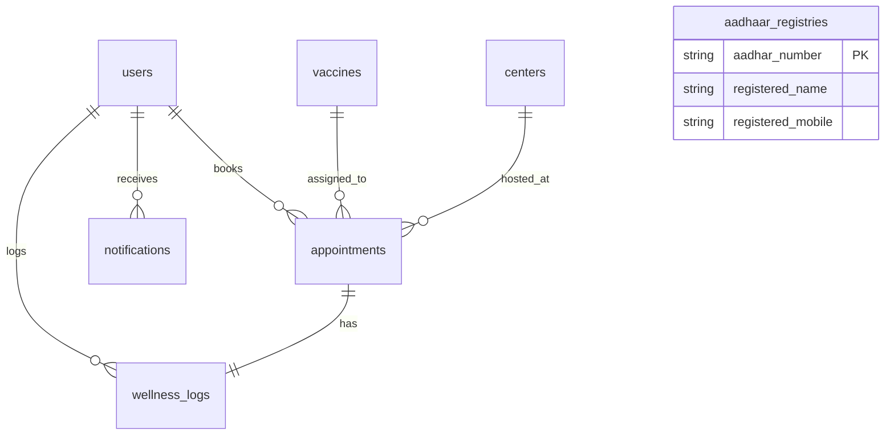

# 🌟 VacciCare (Online Vaccine Management System) - Viva & Project Walkthrough Guide 🌟

Welcome to your comprehensive preparation guide for VacciCare. This document serves as your complete project walkthrough, designed specifically to help you understand the architecture, database schema, file structures, detailed code logic, and core features of this application. By reading and understanding this guide, you will be fully prepared to answer any question in your oral viva or project presentation.

---

## 🗺️ Table of Contents
1. [🏗️ Project Architecture & Tech Stack](#1-project-architecture--tech-stack)
2. [🗄️ Database Schema & Migrations](#2-database-schema--migrations)
3. [📂 File Directory Map (What each file does)](#3-file-directory-map-what-each-file-does)
4. [🔍 Core Features & Detailed Code walkthrough](#4-core-features--detailed-code-walkthrough)
   - [🔐 Authentication & Confetti Controller](#-authentication--confetti-controller)
   - [🆔 Aadhaar e-KYC Verification Gateway](#-aadhaar-e-kyc-verification-gateway)
   - [📜 Digital Certificate & Cryptographic Verification Portal](#-digital-certificate--cryptographic-verification-portal)
   - [💳 Digital Vaccine Wallet Pass (Modern PNG Download)](#-digital-vaccine-wallet-pass-modern-png-download)
   - [⚠️ Aadhaar Exemption & Entry Pass](#-aadhaar-exemption--entry-pass)
   - [🎥 Webcam QR Code Scanner (Healthcare Portal)](#-webcam-qr-code-scanner-healthcare-portal)
   - [🗺️ Interactive District SVG Map](#-interactive-district-svg-map)
   - [⏳ Live Queue Tracker (Deterministic Simulation)](#-live-queue-tracker-deterministic-simulation)
   - [🩺 Wellness Log & Treatment Guidance System](#-wellness-log--treatment-guidance-system)
   - [🔔 DB-Backed Notification Inbox](#-db-backed-notification-inbox)
5. [🐳 Production Boot Sequence & Containerization (Docker)](#5-production-boot-sequence--containerization-docker)
6. [🎙️ Top 20 Expected Viva Questions & Answers](#6-top-20-expected-viva-questions--answers)

---

## 🏗️ 1. Project Architecture & Tech Stack

VacciCare is built on the **Laravel Framework** using the standard **MVC (Model-View-Controller)** software pattern.

### The MVC Workflow in VacciCare
1. **Request**: The client (browser) sends an HTTP request to a URL (e.g., `/user/dashboard`).
2. **Routing**: `routes/web.php` maps the URL to a specific **Controller** method (e.g., `UserController@dashboard`).
3. **Middleware**: Before reaching the controller, the request passes through middleware (e.g., `auth` check or custom `IsAdmin` checks) to ensure permissions are valid.
4. **Controller Logic**: The Controller (e.g., [UserController.php](file:///d:/Projects/OVMS/app/Http/Controllers/UserController.php)) communicates with **Models** to retrieve data.
5. **Models & Database**: The Model (e.g., [User.php](file:///d:/Projects/OVMS/app/Models/User.php)) queries the database (via Eloquent ORM) and returns PHP objects representing records.
6. **Response (View)**: The Controller passes the data to a Blade **View** template (e.g., `resources/views/user/dashboard.blade.php`), which renders HTML using Tailwind CSS and Alpine.js, returning it to the user.

### Tech Stack Details
*   **Core Backend**: PHP 8.3+ and Laravel 11.x/13.x.
*   **Database**: SQLite/MySQL (configured via `.env`). SQLite is used for lightweight development; MySQL/PostgreSQL can be swapped in production.
*   **Asset Bundler & Builder**: **Vite 8.x**, compiling frontend assets.
*   **Styling & UI**: **TailwindCSS v4**, utilizing modern CSS custom properties and HSL-tailored colors. It supports full glassmorphism, responsive grid systems, and a professional dark mode.
*   **Interactive Frontend**: **Alpine.js 3.x** for client-side state management (such as interactive map nodes, wellness toggle cards, and dynamic OTP countdown alerts).
*   **Libraries**:
    *   `html-to-image` (Client-side JS library used to capture DOM cards as PNG files).
    *   `qrcodejs` (Generates client-side QR codes from signed URLs).
    *   `html5-qrcode` (Enables webcam video streaming and real-time QR parsing in the browser).

---

## 🗄️ 2. Database Schema & Migrations

The database structure is managed using **Laravel Migrations** (in `database/migrations/`). The database structure consists of **10 tables**:



### Table Definitions & Purpose
1.  **`users`**: Stores patient and administrator accounts.
    *   *Key Columns*: `id`, `name`, `email`, `phone`, `dob`, `password`, `aadhar_number` (encrypted or plain), `aadhar_verified` (boolean), `role` (default: `'user'`, admin: `'admin'`).
2.  **`vaccines`**: Stores list of available vaccines.
    *   *Key Columns*: `id`, `name`, `manufacturer`, `description`, `doses_required` (integer), `days_between_doses`, `stock` (integer), `price` (decimal), `status` (`'available'`, `'unavailable'`).
3.  **`centers`**: Stores details of physical vaccination centers.
    *   *Key Columns*: `id`, `name`, `address`, `city`, `state`, `pincode`, `phone`, `email`, `opening_time`, `closing_time`, `status` (`'active'`, `'inactive'`).
4.  **`appointments`**: Stores vaccination booking records.
    *   *Key Columns*: `id`, `user_id` (FK), `vaccine_id` (FK), `center_id` (FK), `appointment_date` (date), `appointment_time` (time), `dose_number` (integer), `status` (`'pending'`, `'confirmed'`, `'completed'`, `'cancelled'`), `notes` (text).
5.  **`aadhaar_registries`**: Acts as a **simulated official UIDAI database** containing citizens' official details.
    *   *Key Columns*: `aadhar_number` (PK, string), `registered_name`, `registered_mobile`.
6.  **`notifications`**: Stores dynamic, database-backed notifications.
    *   *Key Columns*: `id`, `user_id` (FK), `title`, `message`, `type` (`'success'`, `'info'`, `'warning'`), `read_at` (timestamp, nullable).
7.  **`wellness_logs`**: Stores patient side-effect logs.
    *   *Key Columns*: `id`, `appointment_id` (FK, unique), `user_id` (FK), `fever` (boolean), `soreness` (boolean), `headache` (boolean), `fatigue` (boolean), `other_symptoms` (text), `logged_at` (timestamp).
8.  **`jobs`**: Laravel's queue job table. Used to store background actions (like sending booking emails and OTP mails) so that the user request cycle does not block.
9.  **`cache`**: Stores Laravel framework cache keys for performance optimization.
10. **`sessions`**: Database-backed user session states.

### Eloquent Relationships (defined in Models)
*   **User Model** ([User.php](file:///d:/Projects/OVMS/app/Models/User.php)):
    *   `public function appointments() { return $this->hasMany(Appointment::class); }`
    *   `public function notifications() { return $this->hasMany(Notification::class); }`
*   **Appointment Model** ([Appointment.php](file:///d:/Projects/OVMS/app/Models/Appointment.php)):
    *   `public function user() { return $this->belongsTo(User::class); }`
    *   `public function vaccine() { return $this->belongsTo(Vaccine::class); }`
    *   `public function center() { return $this->belongsTo(Center::class); }`
    *   `public function wellnessLog() { return $this->hasOne(WellnessLog::class); }`

---

## 📂 3. File Directory Map (What each file does)

Here is a map of the key files in the codebase and their direct purpose:

### Backend Architecture (`app/`)
*   [AuthController.php](file:///d:/Projects/OVMS/app/Http/Controllers/AuthController.php): Manages registration, logins, session regeneration, and logs out user session safely. Seeds a `celebrate` flag to launch confetti upon successful logins.
*   [UserController.php](file:///d:/Projects/OVMS/app/Http/Controllers/UserController.php): Drives user dashboard stats, fetches upcoming appointments, and handles profile updates (validating new Aadhaar updates against OTP gate sessions).
*   [AadharVerificationController.php](file:///d:/Projects/OVMS/app/Http/Controllers/AadharVerificationController.php): Generates secure 6-digit OTP codes, normalizes names to check mismatch exceptions, dispatches background OTP emails, and manages validation gates.
*   [UserFeatureController.php](file:///d:/Projects/OVMS/app/Http/Controllers/UserFeatureController.php): Controls notifications management, Vaccine Wallet Pass configurations, deterministic Queue calculations, Wellness log writing, and Exemption Pass routing.
*   [AppointmentController.php](file:///d:/Projects/OVMS/app/Http/Controllers/AppointmentController.php): Manages appointment queries, bookings, stock decrement transactions, cryptographic certificate signatures generation (`URL::signedRoute`), and signature verification.
*   [IsAdmin.php](file:///d:/Projects/OVMS/app/Http/Middleware/IsAdmin.php): Custom middleware protecting administrator controllers. Aborts with HTTP 403 Forbidden error if user is not authenticated or has a role other than `'admin'`.
*   [AadharOtpMail.php](file:///d:/Projects/OVMS/app/Mail/AadharOtpMail.php) & [BookingConfirmation.php](file:///d:/Projects/OVMS/app/Mail/BookingConfirmation.php): Core email layout drivers. Both implement `ShouldQueue` so SMTP dispatches do not block client threads.

### Front-End Views (`resources/views/`)
*   `layouts/app.blade.php`: The Master Layout containing metadata, Google fonts, loaded Tailwind build pipelines, and AlpineJS setups. Integrates global alerts and canvas confetti.
*   `landing.blade.php`: The guest welcome page featuring responsive CSS design systems, glassmorphism hero headers, interactive sliders, and CTA portals.
*   `auth/login.blade.php`: Dual-pane dashboard offering tabbed login/register widgets synchronized via AlpineJS variables.
*   `appointments/create.blade.php`: Booking screen featuring the inline **Interactive District SVG Map** bound to select drop-downs, dates validation gates, and dose trackers.
*   `appointments/pass.blade.php`: Mobile-first Vaccine Wallet Pass designed as a glassmorphic physical pass. Includes client-side QR renderer and modern `html-to-image` rendering engine.
*   `appointments/queue.blade.php`: User queue tracker showing active tokens, estimations, and crowd indicators.
*   `appointments/wellness.blade.php`: side-effects checklist interface with instant treatment instructions popping up using Alpine states.
*   `appointments/certificate.blade.php`: Government-style vaccination e-certificate with print-only overrides (`@media print`) and verification QR code.
*   `admin/scanner.blade.php`: Healthcare admin portal integrating real-time webcam video stream scan and automatic patient details lookup.

---

## 🔍 4. Core Features & Detailed Code Walkthrough

This section explains the core coding patterns in VacciCare, explaining **exactly how they work** so you can recite them word-for-word in the viva.

### 🔐 Authentication & Confetti Controller
**File**: [AuthController.php](file:///d:/Projects/OVMS/app/Http/Controllers/AuthController.php)

*   **How it works**:
    During registration or login, the user credentials are validated. On success, the session is regenerated (`$request->session()->regenerate()`) to prevent **Session Fixation attacks**. A temporary session flash variable `celebrate` is set to `true`.
*   **The Code**:
    ```php
    if (Auth::attempt($credentials, $request->boolean('remember'))) {
        $request->session()->regenerate();
        return redirect()->route('user.dashboard')
            ->with('success', 'Welcome back!')
            ->with('celebrate', true); // Triggers confetti
    }
    ```
*   **The View Logic** (`layouts/app.blade.php`):
    We check if the session contains the `celebrate` flag. If it does, we inject `canvas-confetti` scripts and fire the animation once.
    ```html
    @if(session('celebrate'))
        <script src="https://cdn.jsdelivr.net/npm/canvas-confetti@1.6.0/dist/confetti.browser.min.js"></script>
        <script>
            document.addEventListener('DOMContentLoaded', () => {
                confetti({ particleCount: 150, spread: 80, origin: { y: 0.6 } });
            });
        </script>
    @endif
    ```
    *Viva Tip: Confetti does NOT fire when logging out, marking notifications read, or updating profiles. It is strictly limited to registration and login screens to avoid clutter.*

---

### 🆔 Aadhaar e-KYC Verification Gateway
**File**: [AadharVerificationController.php](file:///d:/Projects/OVMS/app/Http/Controllers/AadharVerificationController.php)

*   **How it works**:
    1.  The citizen enters a 12-digit Aadhaar number.
    2.  The application queries the `aadhaar_registries` table. If the number does not exist, e-KYC throws a "Not Found" error.
    3.  If found, the system performs a **Strict Name Match**. It normalizes both names (profile name and official registry name) by making them lowercase and stripping excessive whitespace. If they don't match, e-KYC throws an "Identity Mismatch" error.
    4.  If names match, it generates a random 6-digit integer (`mt_rand(100000, 999999)`) and queues a verification email containing the code.
    5.  To make evaluation seamless for external examiners (like on Render hosting), if the app is hosted on a remote domain, it adds `debug_otp` directly to the JSON response payload, letting the examiner copy-paste it without needing an active inbox.
*   **The Name Match Code**:
    ```php
    $profileName  = strtolower(trim(preg_replace('/\s+/', ' ', $user->name)));
    $registryName = strtolower(trim(preg_replace('/\s+/', ' ', $registry->registered_name)));

    if ($profileName !== $registryName) {
        return response()->json([
            'success' => false,
            'message' => 'Identity mismatch. Profile name does not match official Aadhaar record.'
        ]);
    }
    ```

---

### 📜 Digital Certificate & Cryptographic Verification Portal
**File**: [AppointmentController.php](file:///d:/Projects/OVMS/app/Http/Controllers/AppointmentController.php)

*   **How it works**:
    When a citizen completes their doses, their certificate is generated. The system must ensure that the certificate URL cannot be tampered with (e.g., a user trying to change `/verify-certificate/5` to `/verify-certificate/6` to view someone else's document).
    To solve this, Laravel's **Cryptographic Signed Routes** (`URL::signedRoute()`) are used. A secure hash (`signature`) is appended to the query parameter using the application key (`APP_KEY`). If the URL is edited by even a single character, the signature validation fails.
*   **Signed URL Generation**:
    ```php
    $verificationUrl = URL::signedRoute('verify.certificate', ['appointment' => $appointment->id]);
    ```
*   **Signature Verification Route**:
    ```php
    public function verifyCertificate(Request $request, Appointment $appointment) {
        if (!$request->hasValidSignature()) {
            return response()->view('appointments.verify', [
                'success' => false,
                'message' => 'Invalid or Tampered Certificate Signature!'
            ], 403);
        }
        return view('appointments.verify', ['success' => true, 'appointment' => $appointment]);
    }
    ```
*   **Print Overrides** (`appointments/certificate.blade.php`):
    When the user clicks "Print Certificate", standard browser print dialogue is launched (`window.print()`). The stylesheet uses a print media query to hide web elements and formats the certificate neatly:
    ```css
    @media print {
        body { background: white; color: black; }
        .no-print { display: none !important; } /* Hides navbars and action buttons */
        .print-card { border: none !important; box-shadow: none !important; width: 100% !important; }
    }
    ```

---

### 💳 Digital Vaccine Wallet Pass (Modern PNG Download)
**File**: [pass.blade.php](file:///d:/Projects/OVMS/resources/views/appointments/pass.blade.php) & [UserFeatureController.php](file:///d:/Projects/OVMS/app/Http/Controllers/UserFeatureController.php)

*   **How it works**:
    The Vaccine Wallet Pass provides a card representing a mobile wallet pass. To allow users to download it on their smartphones as an image without printing it as a PDF:
    1.  The pass layout is designed using Tailwind CSS glassmorphic parameters.
    2.  A local QR code is generated using `qrcodejs` linking back to the signed verification URL.
    3.  A Javascript download trigger passes the card DOM node to the `html-to-image` rendering engine. It converts the HTML node structure into raw PNG base64 strings and prompts a browser file save download.
*   **Why `html-to-image` instead of `html2canvas`?**
    Tailwind CSS v4 introduces advanced color models such as `oklab()` and `oklch()`. Traditional rendering libraries like `html2canvas` fail to parse these color functions, throwing core execution exceptions (`html2canvas error: Attempting to parse an unsupported color function "oklab"`). `html-to-image` resolves this issue by converting the HTML node recursively into SVG data URLs before rendering to a Canvas, preserving styling.
*   **The JS capture logic**:
    ```javascript
    htmlToImage.toPng(document.getElementById('wallet-card'), {
        pixelRatio: 3, // High-DPI output resolution
        cacheBust: true
    }).then(dataUrl => {
        const link = document.createElement('a');
        link.download = 'VacciCare_Wallet_Pass.png';
        link.href = dataUrl;
        link.click();
    });
    ```

---

### ⚠️ Aadhaar Exemption & Entry Pass
**File**: `appointments/exemption_pass.blade.php` & [UserFeatureController.php](file:///d:/Projects/OVMS/app/Http/Controllers/UserFeatureController.php)

*   **How it works**:
    If a citizen cannot complete Aadhaar e-KYC (e.g., they don't have an Aadhaar card or their name is mismatched), they cannot book online slots. Instead, they are routed to the **Aadhaar Exemption & Entry Pass** portal.
    This generates a physical entry pass containing a QR code that maps to `route('verify.exemption-pass', $user)`. They present this pass at the physical vaccination center.
*   **Bypass Verification Flow**:
    When the healthcare worker scans the QR code using their portal device, if they are logged in as an administrator, they are redirected to the admin appointments booking database search (`/admin/appointments?search={email}`). This automatically loads the citizen's profile and opens the manual verification popup. If scanned by a guest, it shows a public page confirming that the citizen's entry pass is valid.

---

### 🎥 Webcam QR Code Scanner (Healthcare Portal)
**File**: `admin/scanner.blade.php` & [AdminDashboardController.php](file:///d:/Projects/OVMS/app/Http/Controllers/Admin/AdminDashboardController.php)

*   **How it works**:
    Physical center admins need a rapid verification tool. In the admin scanner portal:
    1.  The browser accesses the rear camera stream via `navigator.mediaDevices` using the `html5-qrcode` library.
    2.  Once a QR code is detected, the scan callback triggers a audio tone using the browser's Web Audio API (playing a short confirmation chime).
    3.  It extracts the patient verification URL from the barcode and issues an AJAX request to `/admin/patient-info/{user_id}` to retrieve beneficiary details.
    4.  The administrator reviews the card details, enters the citizen's 12-digit Aadhaar number, and clicks "Verify". This saves the Aadhaar to the database and marks the user as verified.
*   **Audio Chime Generation (Web Audio API)**:
    ```javascript
    const audioCtx = new (window.AudioContext || window.webkitAudioContext)();
    const osc = audioCtx.createOscillator();
    const gain = audioCtx.createGain();
    osc.connect(gain); gain.connect(audioCtx.destination);
    osc.type = 'sine';
    osc.frequency.setValueAtTime(880, audioCtx.currentTime); // High pitch notification note
    gain.gain.setValueAtTime(0.1, audioCtx.currentTime);
    osc.start();
    gain.gain.exponentialRampToValueAtTime(0.001, audioCtx.currentTime + 0.2); // Fades out
    osc.stop(audioCtx.currentTime + 0.2);
    ```

---

### 🗺️ Interactive District SVG Map
**File**: `appointments/create.blade.php`

*   **How it works**:
    To make scheduling interactive, the booking dashboard features an inline **District Vaccination Hubs Map** (an SVG containing interactive elements).
    Using Alpine.js, the SVG elements are bound to the form's `center_id` select dropdown.
    *   Hovering over a district changes its color and displays a tooltip.
    *   Clicking a district highlights it and sets the dropdown's selected value to match the corresponding center.
*   **AlpineJS Map Binding**:
    ```html
    <div x-data="{ selectedCenter: '' }">
        <!-- SVG Map -->
        <svg>
            <path id="center-1" 
                  @click="selectedCenter = '1'" 
                  :class="selectedCenter === '1' ? 'fill-blue-500' : 'fill-slate-700'" />
        </svg>

        <!-- Dropdown Form -->
        <select name="center_id" x-model="selectedCenter">
            <option value="1">AIIMS Primary Health Center</option>
            <option value="2">KEM Hospital</option>
        </select>
    </div>
    ```

---

### ⏳ Live Queue Tracker (Deterministic Simulation)
**File**: [UserFeatureController.php](file:///d:/Projects/OVMS/app/Http/Controllers/UserFeatureController.php)

*   **How it works**:
    To prevent page reloads from giving changing numbers, queue estimates are computed **deterministically** using database states:
    1.  The controller queries all active appointments scheduled at the **same center** on the **same date**.
    2.  It sorts them chronologically (`appointment_time`) and by database ID.
    3.  The index of the user's appointment in this list represents their **Token Number** (e.g. index 5 = Token #6).
    4.  The index of the first appointment that is *not* completed represents the **Currently Serving Token** (e.g., if index 0, 1, 2 are completed, currently serving is Token #4).
    5.  `People Ahead = User Token - Currently Serving Token`.
    6.  `Estimated Wait Time = People Ahead * 10 minutes`.
    7.  If the wait time exceeds 30 minutes, crowd density is flagged as "High"; otherwise, "Medium" or "Low".

---

### 🩺 Wellness Log & Treatment Guidance System
**File**: [UserFeatureController.php](file:///d:/Projects/OVMS/app/Http/Controllers/UserFeatureController.php) & `appointments/wellness.blade.php`

*   **How it works**:
    After immunization, citizens can report post-vaccine symptoms (Fever, Soreness, Headache, Fatigue). The checklist is submitted and stored in the `wellness_logs` table.
    Based on the selected symptoms, the view dynamically renders **Treatment Advice Cards** using AlpineJS:
    *   *Fever selected*: Recommends paracetamol and staying hydrated.
    *   *Soreness selected*: Recommends cold compresses.
*   **Dynamic Instructions Logic**:
    ```html
    <div x-show="fever" class="p-4 bg-amber-500/10 border-l-4 border-amber-500">
        <strong>Fever Care:</strong> Stay hydrated, rest, and take paracetamol (650mg) if temperature exceeds 101°F.
    </div>
    ```

---

### 🔔 DB-Backed Notification Inbox
**File**: [UserFeatureController.php](file:///d:/Projects/OVMS/app/Http/Controllers/UserFeatureController.php) & [Notification.php](file:///d:/Projects/OVMS/app/Models/Notification.php)

*   **How it works**:
    Instead of stateless messages, VacciCare implements a persistent notification log database.
    *   When a user books a slot, a record is added to the `notifications` table.
    *   When an administrator approves, completes, or cancels a booking, a notification is added with the corresponding status.
    *   A navigation bell icon queries the user's unread notifications: `Auth::user()->notifications()->unread()->count()`.
    *   Users can mark notifications as read, which updates the `read_at` column.

---

## 🐳 5. Production Boot Sequence & Containerization (Docker)

To deploy VacciCare, the application is packaged into a **Docker Container** using a **Two-Stage Build Dockerfile**:

1.  **Stage 1 (Node Builder)**: Uses a lightweight Node environment to run `npm run build`, compiling JavaScript, CSS, and Tailwind variables into `/public/build/`.
2.  **Stage 2 (PHP & Nginx)**: Uses a PHP-FPM base image, installs system extensions (SQLite, Nginx, Supervisor), copies the source code and Stage 1 assets, and configures permissions.

### Supervisor Process Manager
A container can typically run only one active process (as PID 1). However, a production Laravel app needs:
1.  **Nginx** to serve web traffic.
2.  **PHP-FPM** to compile PHP files.
3.  **Queue Worker** (`php artisan queue:work`) running in the background to handle emails and OTP dispatches.

VacciCare solves this using **Supervisor** ([supervisord.conf](file:///d:/Projects/OVMS/docker/supervisord.conf)). Supervisor acts as the container's main process, launching and monitoring Nginx, PHP-FPM, and the Queue Worker.

### The Entrypoint Script (`scripts/run.sh`)
When the container boots, it runs a shell script that:
1.  Forces HTTPS routes in production (`export FORCE_HTTPS=true`).
2.  Caches configurations, routes, and views (`config:cache`, `route:cache`, `view:cache`).
3.  Automatically runs migrations and seeds the database (`migrate --force`, `db:seed --force`).
4.  Launches Supervisor.

---

## 🎙️ 6. Top 20 Expected Viva Questions & Answers

Use this Q&A section to quiz yourself before the exam.

### Q1: What is the main design pattern of this application?
**Answer**: It uses the Model-View-Controller (MVC) pattern. Routes direct URLs to Controller methods, Controllers interact with Eloquent Models to query the database, and the data is passed to Blade Views to render HTML.

### Q2: How does the Aadhaar verification name-matching logic handle typos and spacing?
**Answer**: It uses name normalization. It strips out extra spaces using a regular expression (`preg_replace('/\s+/', ' ', $name)`), converts the text to lowercase (`strtolower`), and trims external margins. This ensures minor differences in spacing or capitalization do not cause verification errors.

### Q3: Why did you use `html-to-image` instead of `html2canvas` for downloading the Wallet Pass?
**Answer**: Tailwind CSS v4 uses modern CSS color functions like `oklab()` and `oklch()`. Traditional canvas libraries like `html2canvas` throw errors because they cannot parse these color functions. `html-to-image` avoids this by converting the HTML node recursively into SVG data URLs before rendering to a Canvas, preserving styling.

### Q4: How is a signed URL validated, and how does the application handle host mismatches in production?
**Answer**: Laravel validates signed URLs by checking if the request URL matches the signature parameter hash generated using `APP_KEY`.
Because production deployments (like on Render) may have different host headers than the internal `APP_URL` (causing signature checks to fail), the `verifyCertificate` method includes fallback code. It swaps the external request host header with the internal `APP_URL` host and re-tests the signature, preventing validation errors.

### Q5: What is the benefit of implementing `ShouldQueue` on the mail templates?
**Answer**: By implementing the `ShouldQueue` contract, mail delivery is offloaded to the queue worker. Instead of making the user wait for SMTP servers to connect and send the mail (which can take several seconds and block the request), Laravel inserts a job into the `jobs` database table and returns a response instantly. The supervisor queue worker then processes the email in the background.

### Q6: How does the Live Queue Tracker calculate progress without session states?
**Answer**: It computes data **deterministically** from the database. It queries all appointments scheduled at the same center on the same date and orders them chronologically by time and ID.
The user's index in this list is their **Token Number**. The index of the first appointment that is *not* completed represents the **Currently Serving Token**. The difference between these two indexes is the number of people ahead in the queue.

### Q7: Why do we use SQLite for local development and swap it out for production?
**Answer**: SQLite stores the entire database as a single file on disk, making it lightweight and easy to run locally without installing database engines. For production, we can configure MySQL or PostgreSQL in the `.env` file to handle larger traffic and concurrent connections.

### Q8: What does the custom `IsAdmin` middleware do?
**Answer**: It acts as a route guard. It intercepts incoming requests, checks if the user is authenticated, and checks if their `role` matches `'admin'`. If not, it aborts the request with an HTTP 403 Forbidden status code, protecting admin routes from unauthorized access.

### Q9: What role does Nginx play when Docker containers already run PHP-FPM?
**Answer**: PHP-FPM cannot process HTTP requests directly; it only compiles PHP files via the FastCGI protocol. Nginx acts as the web server, receiving incoming HTTP requests on port 80. It serves static files (like images, CSS, and JS) directly and proxies PHP requests to PHP-FPM for compilation.

### Q10: How does the system prevent stock issues when booking vaccine slots?
**Answer**: When an appointment is requested, the application checks if the vaccine has stock available (`stock > 0`) at the selected center. If stock is available, it decrements the stock count (`$vaccine->decrement('stock')`) before saving the appointment record. If the appointment is later cancelled, the stock count is incremented again to restore availability.

### Q11: How do you handle database migrations and seeders when deploying to a container host?
**Answer**: They are run automatically during container startup. The Docker entrypoint script (`scripts/run.sh`) runs `php artisan migrate --force` and `php artisan db:seed --force` before launching the web server. The `--force` flag ensures the migrations run without requiring interactive user approval.

### Q12: How are interactive elements on the SVG map synchronized with the HTML select form?
**Answer**: It uses Alpine.js two-way binding. The wrapper container declares a shared state variable (`selectedCenter`). Clicking an SVG path sets this variable, and the select element binds its value to the same variable using `x-model`. This ensures clicking a region on the map updates the form select element, and vice-versa.

### Q13: What is the purpose of the `FORCE_HTTPS` environment variable in the boot sequence?
**Answer**: Many cloud hosting services (like Render) handle SSL termination at their load balancers and route traffic to the container as HTTP. This can cause Laravel to generate asset links using `http://`, which browsers block as mixed-content errors. Setting `FORCE_HTTPS=true` forces Laravel to generate all asset and route links using `https://`.

### Q14: How does the application prevent cross-site request forgery (CSRF)?
**Answer**: Laravel automatically inserts a CSRF token into user sessions and verifies it on incoming POST/PUT/DELETE requests using the `@csrf` directive in Blade forms. This ensures the request was submitted by the authenticated user and not by a third-party site.

### Q15: How are temporary e-KYC OTP codes validated?
**Answer**: When an OTP is generated, it is stored in the user's session along with the verified phone number and an expiration timestamp (`now()->addMinutes(5)`).
When the user submits the code, the system checks if the session keys exist, verifies that the code has not expired, and checks if the submitted code matches the stored value.

### Q16: How do you fetch patient information on the Admin Scanner Portal?
**Answer**: The portal queries the backend via an AJAX GET request using the route `/admin/patient-info/{user}`. The controller returns the patient's ID, name, email, date of birth, and Aadhaar verification status as a JSON payload, which is then rendered on the admin interface.

### Q17: What does the database seeder do?
**Answer**: The database seeder (`DatabaseSeeder.php`) populates the database with initial testing data. It inserts mock Aadhaar registry records, an admin user, patient users, available vaccines, centers, and sample appointments. This allows the application to be tested immediately after database migrations run.

### Q18: How does the notification bell component update dynamically?
**Answer**: The navigation bar view checks the count of unread notifications for the authenticated user (`Auth::user()->notifications()->unread()->count()`). If the count is greater than 0, it displays a red badge with the number of unread notifications.

### Q19: Why does the system set the `celebrate` session flag only on registration and login?
**Answer**: Setting the `celebrate` flag only on registration and login ensures that confetti animations only fire during onboarding and authentication events. Firing confetti for minor actions (like marking notifications read or booking appointments) would clutter the user experience.

### Q20: How are wellness logs related to appointments?
**Answer**: The `wellness_logs` table has an `appointment_id` column with a **unique constraint**. This establishes a **One-to-One relationship** between appointments and wellness logs, ensuring a patient can log symptoms only once per vaccination dose.

---

*This guide contains everything you need to know about the VacciCare project codebase. Review the code files linked above to match these explanations with the actual code.*
